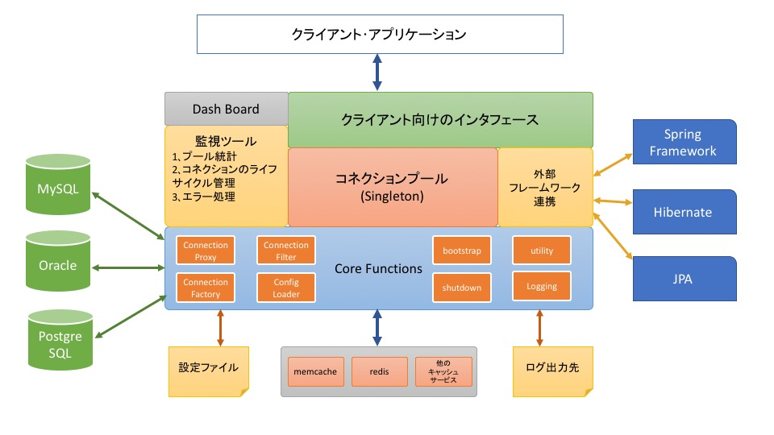

# 概要
オープンソースの[C3P0](http://www.mchange.com/projects/c3p0/)とApacheの[Commons-DBCP](http://commons.apache.org/proper/commons-dbcp/)は一番良い参考プロジェクトだと思う｡

基本機能はメモリ上に予めDB接続を用意し､クライアントにその接続を貸して､接続の状態管理をします｡

## 要件

* アプリに使われるすべてのDB接続を管理するため､マルチスレッドの環境(特に**Webアプリ**の場合)で正しく動作する必要
* パフォーマンスと耐障害性を考慮する上､DB接続の初期化､ステータスチェック､エラー処理(リトライ等)を実現する必要
* 開発と統計監視の機能が望ましい
* 各種なデータベース環境､システム規模を柔軟に対応できる高度な機能があればもっと良い

## 機能

* クラアンと向けのインタフェース(Thread Safe)
    * borrowConncetion()
    * releaseConnection()
* システム向けのインタフェース
    * bootstrap()
    * shutdown()
* 内部機能
    * 設定ファイルの読み込み､解析
        * property、XMLまたはYAMLの設定ファイル
        * Javaなら、Annotation､Groovy形式の設定もいい
    * 設定によるDB接続のFactory
        * データベース種類、ドライバーのバージョンによってDB接続を作成
        * データベース特性のサポート
    * 接続プール保持のコンテナ(Sington)の初期化、停止（destroy）
        * 最小接続数のコネクションを初期化
        * すべてのコネクションを切断
        * コネクションのライフサイクルの管理
        * 最大コネクション数を達する場合、クライアントのリクエストをキューで管理
        * 以下の監視スレッドの起動、停止
    * 監視スレッド
        * 接続エラー処理
            * 設定によって、未Commitのトランザクションを処理
            * エラーログ
            * エラーログによって、SQL実行を自動的にリトライ
                * データベースが一時停止の対応
        * 接続プールの統計､監視
            * SQL実行回数
            * Slow SQLの記録
            * 実行したSQL（パラメータを含む）のデバッグログを出力
            * Javaなら、JMXのサポートなど
            * プールのステータス確認､管理
                * WebコンソールまたはRESTのJsonレスポンス
        * 接続オブジェクトごとの監視､管理
            * 実行時間が長すぎ、またはクライアントのスレッドが反応無しの場合、コネクションを強制的に切断、ログ記録
                * Timeoutしたコネクションの回収
            * コネクションの死活監視
            * 最大接続数までコネクションを作成
            * 低負荷の場合、アイドリングのコネクションを解放
            * SQLのセキュリティチェック(read onlyのコネクション可能)
    * 他のフレームワークとの連携
        * Javaなら、Spring Framework、Hibernate、JPAなどの対応
* 高度な機能
    * 複数種類のデータベースの対応
        * 動的に接続先のデータベースを切り替え
    * 分散トランザクション(複数のデータベースをまたがる)
    * 大規模データベースの対応(Partitionの場合)
        * シャーティングテーブル
        * Master-SlaveのデータベースCluster
    * 非同期のサポート
        * 非同期のコネクション取得、返却(callbackメソッドを用意)
        * SQLをまとめてbatch実行(callbackメソッドを用意)
    * キャッシュ
        * SQL statementのキャッシュ
        * 実行結果のキャッシュ
        * 外部キャッシュサービス連携（memcache、redis、AWSのElastic Cacheなど）

## アーキテクチャ

## 実現

